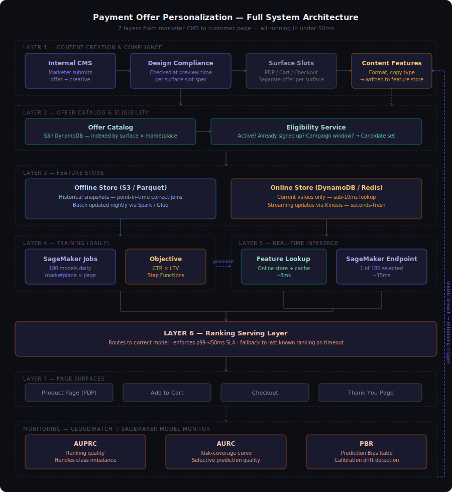
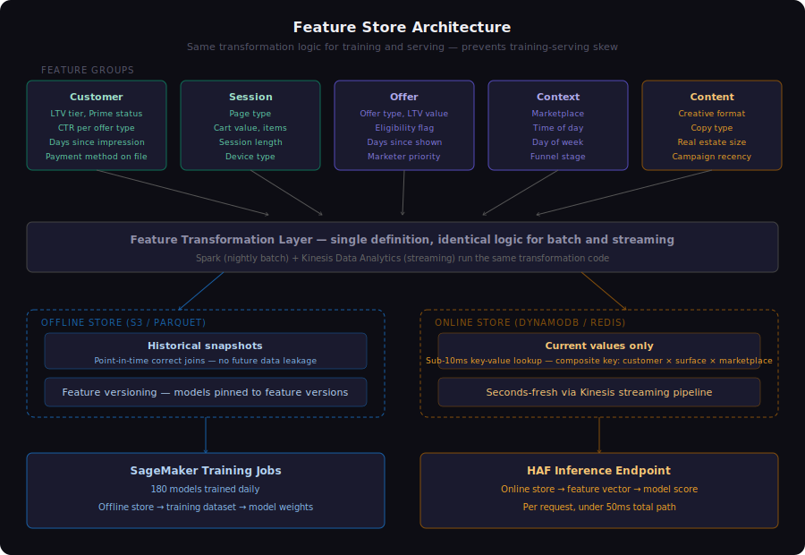
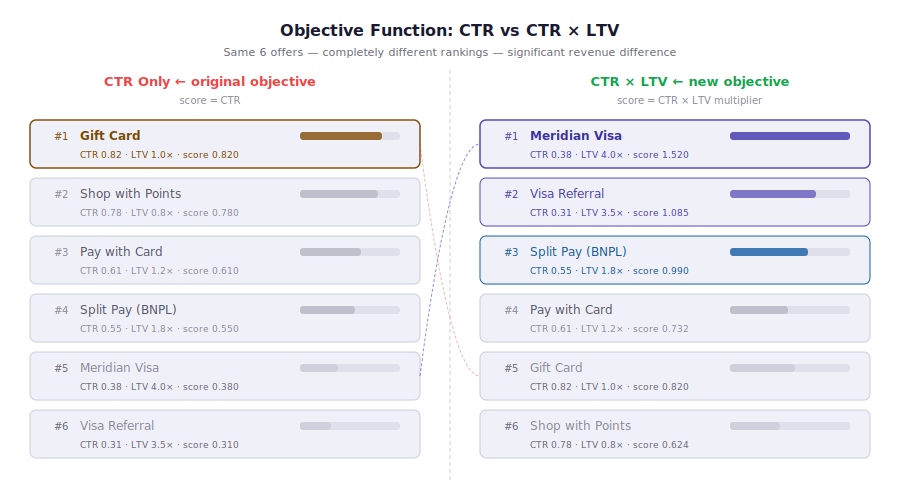
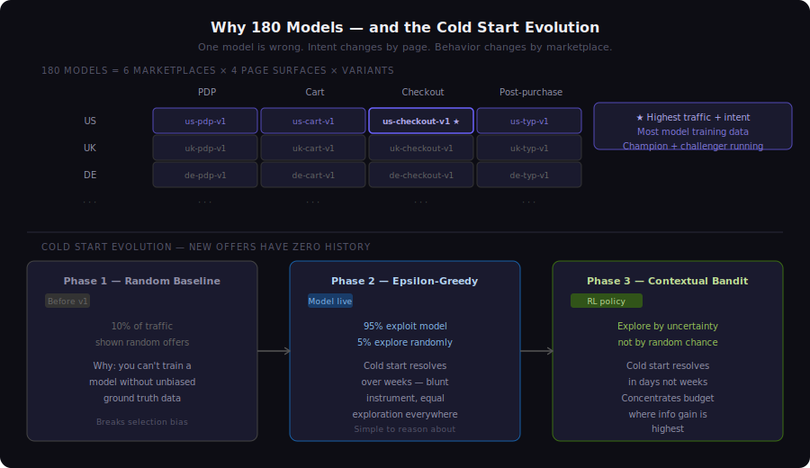
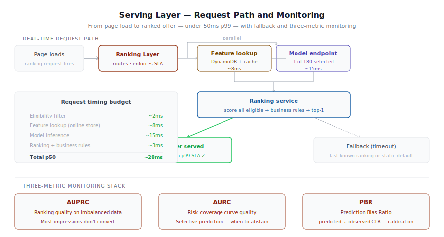

# How Personalization Actually Works at Scale

### What it takes to rank one offer out of six — on 400 million product pages, in under 50ms, without breaking anyone else's metrics

---

Most explanations of recommendation systems skip the hard parts.

They show you a collaborative filtering diagram, mention embeddings, maybe reference Netflix. What they don't show you is everything that has to work before the model ever runs — and everything that has to hold after it does.

This document is about the hard parts.

I spent four years building payment offer personalization systems at scale. This is a technical breakdown of what those systems look like — the architecture, the decisions, the tradeoffs, and the organizational constraints that shape every technical choice. These are industry patterns. The fact that I know them in this depth is because I was inside building them.

---

## The deceptively simple question

When you land on a product page, a system decides in real time which payment offer to show you — a co-branded credit card, a buy-now-pay-later option, a gift card, a points redemption offer, or nothing at all.

One slot. One offer. Hundreds of millions of decisions per day.

The question sounds simple: *which offer should we show this customer, right now, on this page?*

The answer requires seven distinct layers of infrastructure, four cross-org alignment conversations, and a monitoring stack that watches for failures you haven't imagined yet.

Here's what that looks like.

---

## The seven layers



### Layer 1 — Content creation and compliance

Before a model ever scores an offer, a human has to create it.

Marketers submit offers through an internal CMS. Each offer includes creative assets — copy, images, layout — along with targeting parameters, campaign windows, and eligibility rules. Before any offer enters the ranking system, it goes through a **design compliance check at preview time**.

Each page surface has a defined real estate slot with exact specifications: dimensions, character limits, image aspect ratios, interaction patterns. A checkout page slot is not the same as a product detail page slot. A marketer who wants their offer to appear on all four surfaces has to submit **four separate offers** — one per surface — each conforming to that surface's spec.

This is a deliberate product decision. Compliance checking happens at submission time, not at inference time. By the time a request hits the ranking system, every offer in the candidate pool has already been validated. No compliance logic runs inside the latency budget.

The side effect: a co-branded card team wanting presence across all four surfaces has to manage four separate creative submissions. That's friction. It's the right tradeoff.

**What content characteristics become model features:**
- Creative format (banner, inline, modal)
- Copy type (discount, aspirational, urgency)
- Real estate size relative to surface
- Offer type encoded categorically
- Campaign recency
- Historical CTR for this specific creative variant

That last one creates a problem we'll come back to.

---

### Layer 2 — The offer catalog and eligibility service

Compliant offers land in an offer catalog, indexed by surface × marketplace. At request time, an eligibility service filters this catalog to produce the **candidate set** — the offers this specific customer is actually eligible to see right now.

Eligibility checks include:
- Is the campaign active?
- Has this customer already signed up for this product?
- Is the customer in the right marketplace?
- Is the offer within its campaign window?
- Does the customer meet the targeting criteria?

This filtering happens before the model runs. A customer who already has the co-branded card will never see the card acquisition offer — it never enters the candidate set. The model never wastes a score on it.

The candidate set size varies significantly. A new customer in the US marketplace at checkout might have five eligible offers. A power user in a thin marketplace might have two. This variation matters for the model — which we'll get to — and it matters for something called **supply health**, which is a metric most teams don't watch until it's too late.

---

### Layer 3 — The feature store



This is the infrastructure layer that makes everything else possible — and the one most commonly underestimated in scope.

A feature store is a system for computing, storing, and serving the input signals (features) that the model needs to make a prediction. It has two modes:

**Offline store** — backed by S3 and columnar storage (Parquet). Holds months of historical feature snapshots. Used for model training. The critical property: **point-in-time correctness**. When you train a model on historical data, you need to know what the feature values *were* at the time of each historical decision — not what they are today. Without point-in-time joins, you leak future information into training and your model looks better offline than it performs online. This is one of the most common silent failure modes in ML systems.

**Online store** — backed by DynamoDB and ElastiCache. Holds only current feature values. Serves predictions in under 10ms. No history, no aggregations — just the current state of the world for this customer, this offer, this context.

**Why one system for both?** Because the definition of every feature must be identical between training and serving. If "days since last impression" means one thing in your Spark training job and a slightly different thing in your inference microservice, your model is trained on data it will never see in production. This is called **training-serving skew** and it silently degrades model performance in ways that are nearly impossible to debug after the fact.

A single transformation layer — same code, run in batch by Spark nightly and in streaming by Kinesis continuously — is what prevents this.

**The five feature groups in this system:**

| Group | Examples | Latency requirement |
|-------|----------|-------------------|
| Customer | LTV tier, membership status, CTR per offer type, days since last impression, payment method on file | Online, <10ms |
| Session | Page type, cart value, session length, device type | Online, <10ms |
| Offer | Offer type, LTV value, eligibility flag, days since shown to this customer | Online, <10ms |
| Context | Marketplace, time of day, day of week, funnel stage | Inline, <1ms |
| Content | Creative format, copy type, real estate size, campaign recency | Online, <10ms |

---

### Layer 4 — The objective function



This is the decision that changed everything.

The original system optimized for **click-through rate**. Show the offer most likely to get clicked. Sounds reasonable. The problem: CTR is a proxy for what you actually want, and it's a bad one.

High-CTR offers are low-friction offers. Gift cards get clicked because they're familiar and easy. A co-branded credit card application requires more commitment — it's higher friction. Under CTR optimization, the model systematically deprioritized high-friction high-value offers in favor of low-friction low-value ones.

The result: the ranking system was efficiently delivering clicks to offers that generated relatively little downstream revenue, while burying offers that would have generated significantly more.

**The fix: shift the objective to CTR × LTV**

Lifetime value (LTV) measures the total revenue a customer generates as a result of accepting an offer. For a co-branded credit card, LTV has three components:

1. **Card acquisition fee** — a one-time fee paid per approved signup
2. **Spend lift** — cardholders with 5% cashback spend significantly more on the platform
3. **Membership retention** — customers upgrade or maintain premium membership to maximize the cashback benefit

For a gift card, LTV is a single number: one-time margin on the card value, minus breakage.

The LTV difference between these two offer types is roughly **4×**. Under CTR-only ranking, a gift card with 2× the click rate of a credit card wins. Under CTR × LTV ranking, the credit card wins unless the click rate gap exceeds 4×.

**Building a common LTV methodology was harder than building the model.**

You cannot train CTR × LTV until every offer has an LTV expressed in the same units, on the same time horizon, with the same discount rate. Getting finance, product, and data science aligned on a single framework — across offer types that have structurally different revenue models — required more stakeholder work than everything else in this project combined.

---

### Layer 5 — The 180 models



One model is wrong. Here's why.

User intent changes by page. A customer on a product detail page is browsing — they haven't committed to buying anything. A customer on the checkout page has a cart full of items and a credit card ready. These are not the same customer in the same state. Showing them the same ranked offers, scored by a model that doesn't distinguish between these contexts, leaves significant performance on the table.

User behavior also changes by marketplace. Customers in the US marketplace have different payment habits, different credit profiles, and different offer familiarity than customers in the UK or Germany. A model trained on US data will be miscalibrated for European traffic.

The solution: one model per **marketplace × page surface** combination.

With 6 marketplaces and 4 page surfaces, that's 24 models minimum. Add seasonal variants, test models, and challenger models running alongside champions, and you're at 180 training jobs running daily.

Each model is a SageMaker Training Job pulling features from the offline store, trained on the past N days of impression and conversion data for that specific marketplace-surface combination. Step Functions orchestrates all 180 jobs nightly. Each job runs independently — a failure in the UK cart model doesn't block the US checkout model.

**The cold start problem**

Every new creative has zero CTR history when it first enters the system. The model has content features — format, copy type, offer type — but no performance signal for this specific creative. The system went through three phases:

**Phase 1 — Random exploration:** Before the first model existed, a random 10% of traffic was used to collect unbiased training data. If you only observe outcomes for offers the ranker chose to show, you only learn about those offers. You never learn what would have happened with the ones you suppressed. Random exploration breaks this selection bias.

**Phase 2 — Epsilon-greedy:** Once the model was live, 5% of traffic explored randomly, 95% exploited the model's predictions. New creatives got exposure. Cold start resolved over weeks.

**Phase 3 — Contextual bandit (RL):** Epsilon-greedy treats all exploration equally — it's as likely to explore an offer with 1,000 impressions as one with 10. A contextual bandit concentrates exploration where model uncertainty is highest. New creatives in data-rich surfaces resolve cold start in days instead of weeks. The policy learns which offers to explore aggressively and which to exploit confidently.

---

### Layer 6 — The serving layer



Training a model is not shipping a product. The serving layer is where the product lives.

**The request path:**

1. Customer loads a page — ranking request fires
2. A high-availability routing layer dispatches the request to the correct model based on marketplace × page key
3. In parallel: feature lookup fetches 40+ feature values from DynamoDB/ElastiCache (~8ms), model endpoint scores all eligible offers (~15ms)
4. Ranking service combines scores, applies business rules, returns top-1 offer
5. Total path: < 50ms p99

**Latency is a product requirement, not an engineering preference.** Page render waits for the ranking response. If ranking adds 200ms to page load, that's a measurable conversion impact — which means the retail team has a legitimate complaint. The p99 latency SLA is enforced by the routing layer, not hoped for by engineering.

**Fallback logic matters more than you'd think.** When a SageMaker endpoint is slow or unavailable, the routing layer falls back to the last known ranking or a static default. No blank slot on the page. No error state visible to the customer. Graceful degradation is designed in, not bolted on after an incident.

---

### Layer 7 — Monitoring

A model that was accurate yesterday can be wrong today. Markets change. Customer behavior shifts. New offers enter the catalog. Infrastructure has incidents. Monitoring is how you know before your metrics do.

**Three model-level metrics:**

**AUPRC (Area Under the Precision-Recall Curve)** — measures ranking quality on an imbalanced problem. Most impressions don't convert. A model that predicts no conversions ever gets 95%+ accuracy — AUC-ROC doesn't expose this, AUPRC does.

**AURC (Area Under the Risk-Coverage Curve)** — measures selective prediction quality. As you raise the model's confidence threshold, coverage decreases and risk (error rate) should also decrease. AURC measures how well the model maintains low error at high coverage. A model with poor AURC either makes too many mistakes or has to abstain on too much traffic to stay accurate. This is critical when 180 models have wildly different data richness — a thin marketplace model should have a very different confidence profile than a US checkout model.

**PBR (Prediction Bias Ratio)** — predicted CTR divided by observed CTR. A PBR of 1.0 means the model is perfectly calibrated. A PBR of 1.3 means predictions are 30% higher than reality — which means CTR × LTV scores are systematically inflated, which means rankings are wrong even if AUPRC looks fine. PBR is the metric that catches the failure mode the other two miss.

These three metrics run across all 180 models. When any metric breaches its threshold, Step Functions fires a retraining trigger for that specific model — not a full retrain of all 180.

---

## The governance problem

None of this shipped because the ML was good. It shipped because the right people agreed it was safe.

The ranking system served multiple organizations simultaneously: payments, retail, risk, finance, engineering. Any change to the objective function affected all of them. The retail team had seen ranking changes hurt their conversion metrics before. The risk team had approval rate floors they wouldn't negotiate. Finance owned the LTV methodology and had to sign off on any change to how value was measured.

The approach that worked:

**Lead with off-policy evaluation.** Before asking anyone for anything, replay historical impression data through the new objective and show what *would have happened*. Bound the upside. Bound the downside. Show the retail health impact, the latency impact, the approval rate impact — all simulated, all before a single live customer sees the change.

**Agree on guardrails before agreeing on goals.** The conversation that unlocked everything wasn't "here's the lift we'll generate." It was "here are the three things that will never regress, and here's how we'll measure them." Once everyone agreed on the floor, the ceiling became negotiable.

**Stage every rollout with explicit rollback criteria.** 10% traffic, one surface, one marketplace. Hold for two weeks. Expand only if all guardrails hold. Define rollback criteria before launch — not during an incident at 2am.

This is what AI product management at scale actually looks like. The model is a small fraction of the work.

---

## The demo

This repo includes a working mock commerce platform — Meridian Commerce — with the personalization engine running visibly on top of it.

You can browse the storefront, switch between customer personas, and watch in real time as the personalization system changes which products and offers are surfaced. An inspector panel shows the model's reasoning: which features drove the ranking, what the scores were, why this offer won over that one.

**[→ Live demo](https://your-username.github.io/meridian-personalization)**

**[→ Running locally](#running-locally)**

---

## Running locally

```bash
git clone https://github.com/your-username/meridian-personalization
cd meridian-personalization
npm install
npm run dev
```

Open `http://localhost:5173`

---

## Repo structure

```
meridian-personalization/
├── README.md                    ← you are here
├── diagrams/                    ← architecture SVGs
│   ├── 01-full-architecture.svg
│   ├── 02-feature-store.svg
│   ├── 03-objective-function.svg
│   ├── 04-180-models.svg
│   └── 05-serving-layer.svg
├── docs/
│   └── ltv-methodology.md       ← how LTV is calculated across offer types
└── src/                         ← demo application
```

---

## About

**Satya** — Senior Product Manager with four years building ML-powered personalization and payment systems at scale. Currently exploring AI PM roles at companies building at the intersection of commerce, payments, and machine learning.

[LinkedIn](https://linkedin.com/in/your-profile)

---

*Meridian Commerce is a fictional platform. Architecture reflects real patterns from production systems. Numbers are illustrative. Nothing here is proprietary to any employer.*
